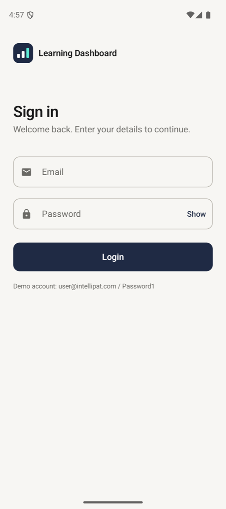
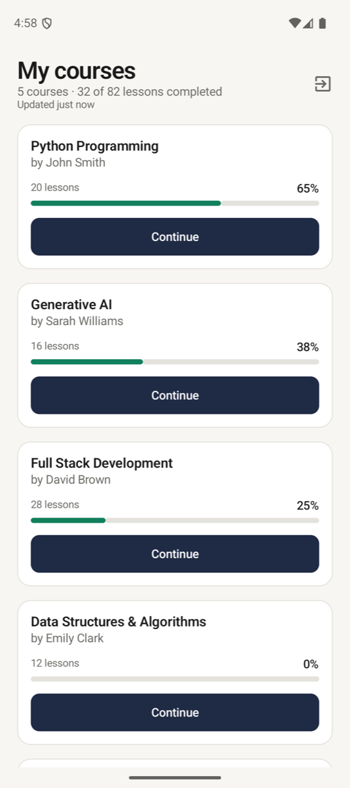
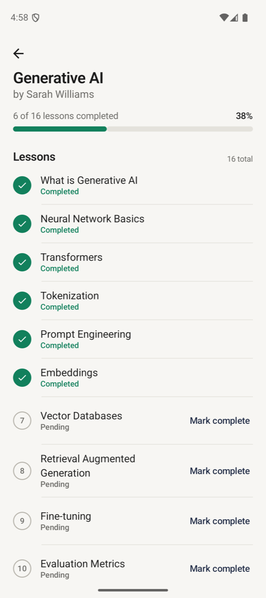

# Learning Dashboard — Android (Kotlin · Compose)

Login → Course Dashboard → Course Details → mark lessons complete. Offline-first with background sync.
**Stack:** Compose, Koin, Room, WorkManager, Retrofit/OkHttp (mocked backend), kotlinx-serialization.
**Demo login:** `user@intellipat.com` / `Password1` · **Build:** `./gradlew :app:assembleRelease` → `learning-dashboard-1.0-release.apk` · **Demo video:** [`docs/demo.mp4`](docs/demo.mp4) · **Tests:** `./gradlew :app:testDebugUnitTest` (39) and `:app:connectedDebugAndroidTest` (7)

## Screenshots

  
  
  

## 1. Architecture
MVVM with a repository, in three packages: `ui` (Compose screens and ViewModels exposing immutable `StateFlow` state), `domain` (models, repository interfaces, errors, pure logic such as `ProgressCalculator`) and `data` (Room, Retrofit, repository implementations). ViewModels depend only on domain interfaces, so they are unit-testable with fakes. HTTP and parsing exceptions become domain errors inside the data layer, and Koin wires everything. I skipped use-case classes because they would only pass calls through at this size. The mock backend is one OkHttp interceptor, switched by `USE_MOCK_BACKEND`.

## 2. Offline Support
Room is the single source of truth and the UI only observes its `Flow`s, so previously loaded courses show with no network. Completing a lesson writes locally first and flags it `isSyncPending`. WorkManager (network-constrained, exponential backoff) pushes it and refreshes when connectivity returns. `LessonMerger` stops a refresh overwriting unsynced progress. The last sync time is stored: data older than 5 minutes is refreshed on open and flagged stale. A permanently rejected completion (4xx except 401/408/429) is reverted and the user is told.

## 3. Security
Today the access token is encrypted with a non-exportable Android Keystore AES-GCM key (`KeystoreSessionStorage`), never in plain SharedPreferences or logs. In production I would keep that, and use a short-lived access token plus a rotating refresh token. Also in place: `allowBackup=false`, R8 on release, a debug logger that never prints headers or bodies, and logout that clears the token and database.

## 4. Scale (1M users, hundreds of courses): what I would improve
1. Delta sync (`updatedSince`/ETag) and Paging 3 instead of downloading everything; load lessons per course on demand.
2. Push-triggered sync (FCM) instead of 15-minute polling, with jittered backoff so retries do not arrive together.
3. Batched, idempotent progress events with server-side aggregation; CDN caching of course content.
4. Refresh-token rotation with reuse detection and certificate pinning.
5. Crashlytics and sync metrics, plus modularising the app for build times. (Already done for large data: stale-row deletes are chunked to stay under SQLite's variable limit, tested at 33k rows.)
